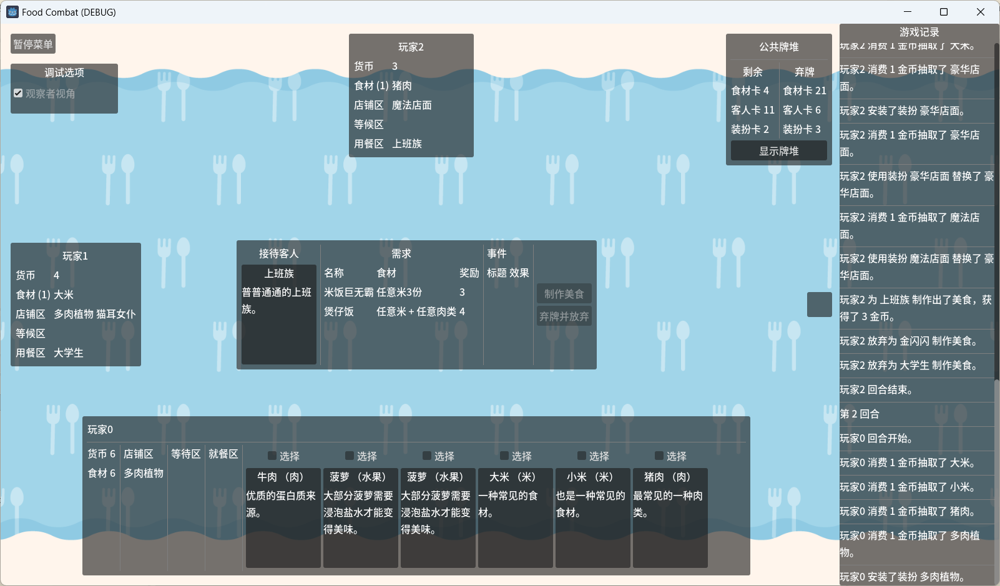

# FoodCombat

由 [Lansiny](https://github.com/Lansiny/) 策划的原型卡牌游戏《美食大作战》 。

由于在开发的过程中我们发现这个游戏“什么都好，就是不好玩”，于是停止了开发。

## 经验总结

在开发游戏的过程中，我们尝试了一些以前没有尝试过的新东西：

- 随用户输入而滚动的日志窗口 `components/log_container.tscn`
- 使用 [coi_serviceworker.js](https://github.com/gzuidhof/coi-serviceworker) 解决因缺失跨域头而导致 Web 导出无法在 GitHub Pages 上运行的问题
- 基于 Godot Resource 实现的数据与外观的分离 `models/card.gd` `models/flat_card.tscn` `models/visual_card.tscn`
- 基于 Callable 的动态卡片效果 `models/customer.gd`等
- 基于状态机的 Player 和场景 `models/player` `scenes/PlayScreen`
- 加深了对 Godot 各方面的（特别是对 Control 的）理解。
